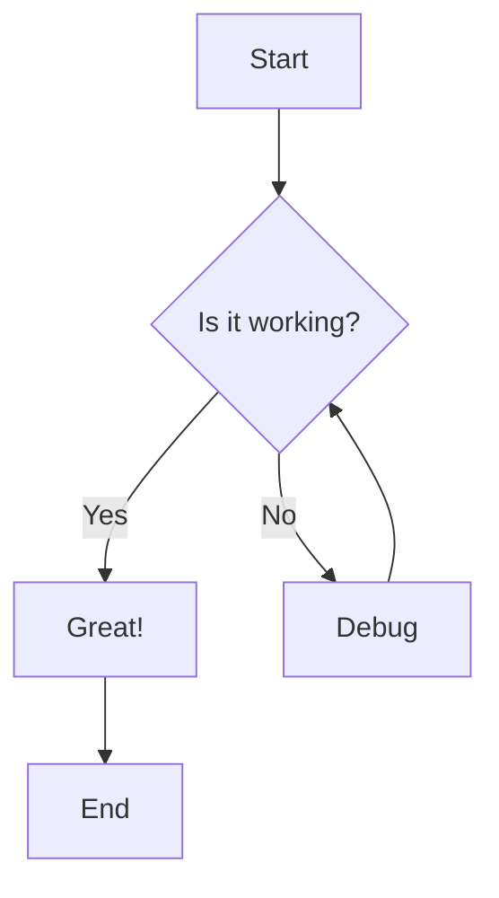
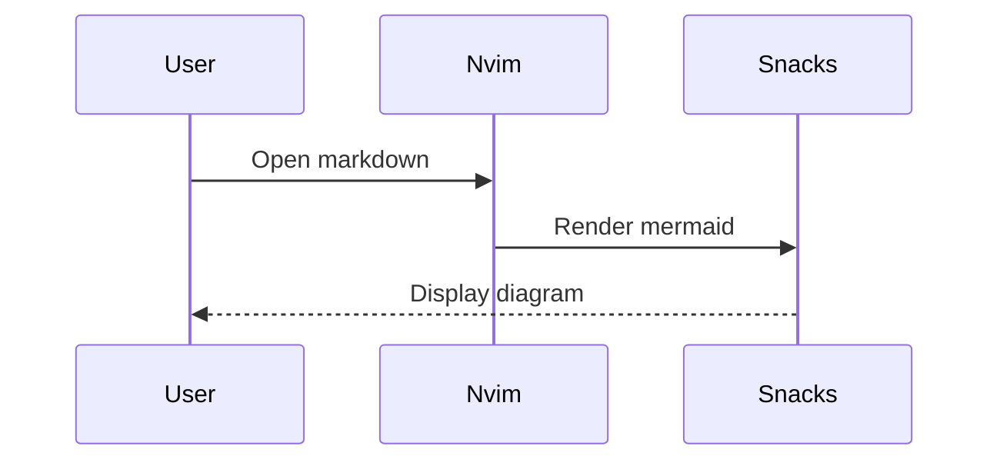
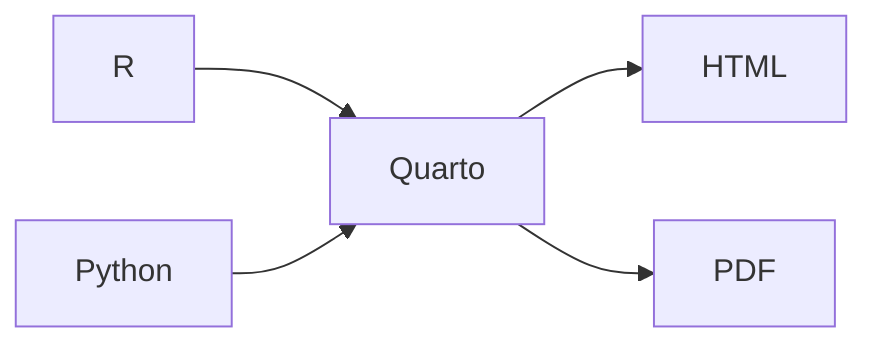

# Mermaid Diagram Test

## Flowchart

```mermaid
graph TD
    A[Start] --> B{Is it working?}
    B -->|Yes| C[Great!]
    B -->|No| D[Debug]
    D --> B
    C --> E[End]
```

## Sequence Diagram

```mermaid
sequenceDiagram
    participant User
    participant Nvim
    participant Snacks
    User->>Nvim: Open markdown
    Nvim->>Snacks: Render mermaid
    Snacks-->>User: Display diagram
```

## Simple Graph

```mermaid
graph LR
    R[R] --> Quarto
    Python --> Quarto
    Quarto --> HTML
    Quarto --> PDF
```
